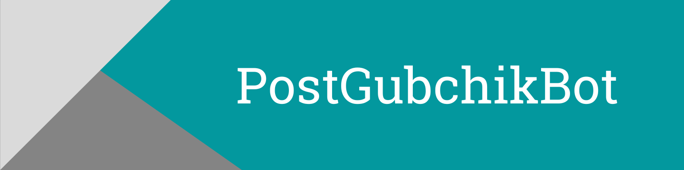

<a href="https://t.me/PostGubchikBot" target="_blank"></a>
_Bot - an assistant for channel and chat owners, publishes posts at specified intervals and settings._

### Demo

Click **<a href="https://t.me/PostGubchikBot" target="_blank">here</a>** to open telegram PostGubchikBot

### Project modules (requirements.txt)

<a href='https://pypi.org/project/aiogram'></a> <a href='https://pypi.org/project/APScheduler'></a> <a href='https://pypi.org/project/psycopg2'></a> <a href='https://pypi.org/project/python-dotenv'></a> <a href='https://pypi.org/project/python-Levenshtein'></a> <a href='https://pypi.org/project/pytz'></a> <a href='https://pypi.org/project/SQLAlchemy'></a> 

---

### Features

1. Publishing posts.
2. Publishing posts in the queue.
3. Grouping media into albums.
4. Forced publication from the queue.
5. Ability to set the release time of posts, for example from 8:20 to 22:20 s
at intervals of 2 hours. And from the queue for example: 8:22, 9:33, 10:56, etc.
6. Channel grouping.
7. Ability to edit pending posts, edit.
deferred posts in the queue.
8. Ability to set a timer for deleting posts.
9. Working with chats.
10. Subscriptions.
11. Referrals.
12. Setting the timezone.
13. Russian and English languages.
14. Payments.

### Environment Variables

To run this project, you will need to add the following environment variables to your .env file

`ADMINS`
`DATABASE_URL`
`BOT_TOKEN`
`PAYMENTS_PROVIDER_TOKEN`

### Run Locally

Clone the project

```
  git clone https://git.dzencode.com/crm.29924/easypostbot.git
```

Go to the project directory

```
  cd easypostbot
```

Install dependencies

```
  pip install -r requirements.txt
```

Run the bot

```
  python bot/run.py
```

> **Note:** Don't forget about environment variables